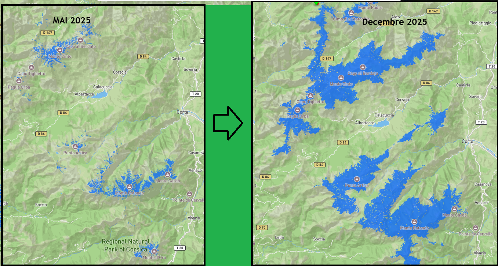

# Visualisation de l'enneigement avec Copernicus

Mountain Journey intègre une couche de visualisation de l'enneigement basée sur les données du programme européen **Copernicus**.

## Exemple de rendu



## Source des données

Les données sont issues des satellites **Sentinel** du programme **Copernicus**. Les observations sont actualisées à chaque nouveau passage du satellite, soit environ tous les **5 jours** selon la couverture disponible.

## Traitement des données

Les images satellitaires sont traitées à l'aide de l'algorithme **Let It Snow (LIS)**, développé pour détecter automatiquement les zones enneigées à partir des données d'observation de la Terre.

Les zones identifiées comme couvertes de neige sont ensuite transformées en tuiles cartographiques optimisées pour un affichage web.

## Affichage dans Mountain Journey

Les tuiles générées sont intégrées dans l'application via **Mapbox**.

Les surfaces enneigées sont représentées en **bleu**, permettant de visualiser rapidement les secteurs où la présence de neige a été détectée.

## Chaîne de traitement

```text
Sentinel (Copernicus)
         ↓
 Acquisition des images satellites
         ↓
 Algorithme Let It Snow (LIS)
         ↓
 Détection des zones enneigées
         ↓
 Génération des tuiles vectorielles
         ↓
      Affichage Mapbox
         ↓
      Mountain Journey